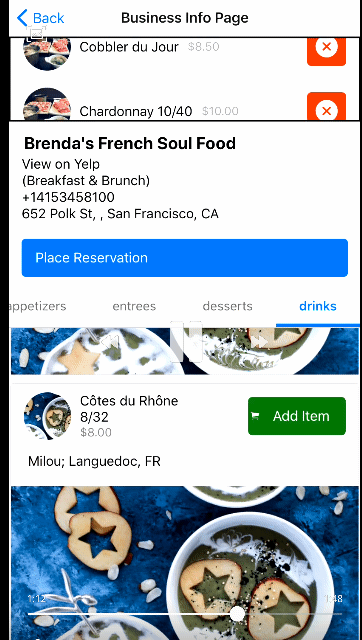
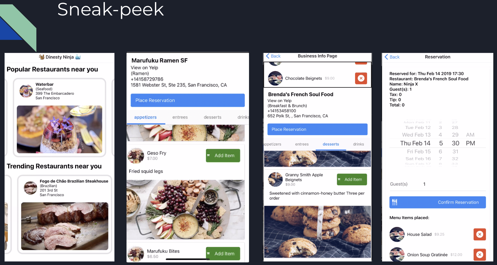
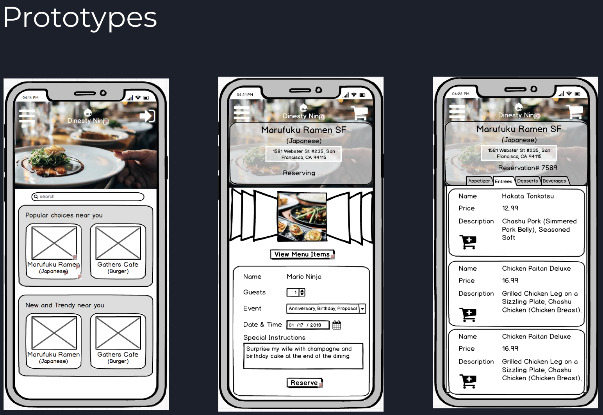
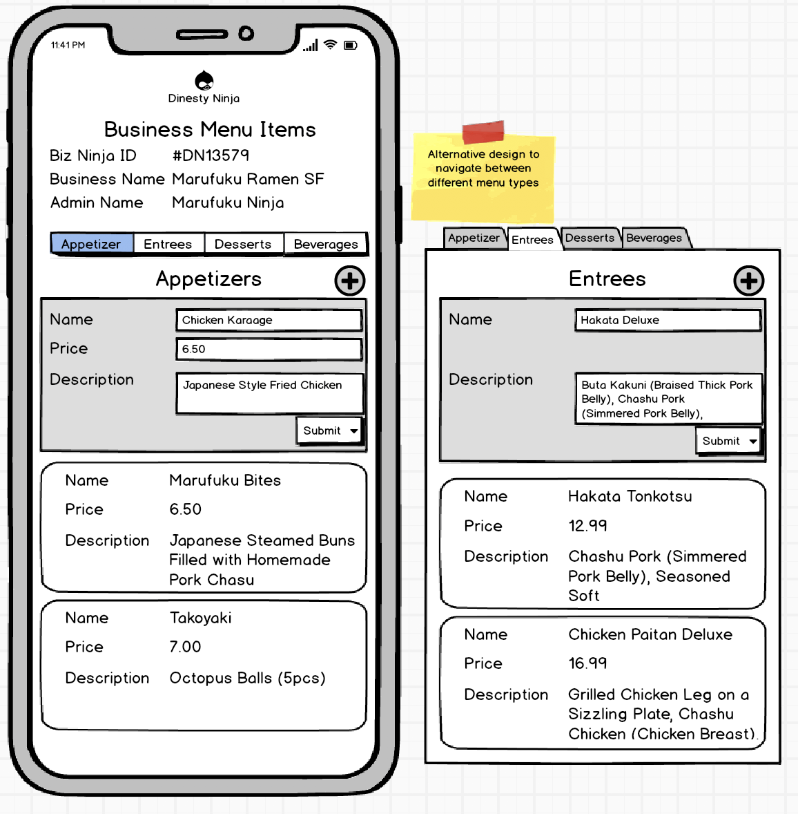

## Dinesty.ninja (Skip the wait, Enjoy the meal)
### Powered by React Native, Go, MongoDB, Docker, AWS EC2, Firebase Authentication, Yelp API
### Frontend: https://github.com/seintun/dinesty.ninja-reactnative
### Backend: https://github.com/seintun/dinesty.ninja-golang

#### Demo:

#### App at a glance:

#### Wireframing Prototypes:

